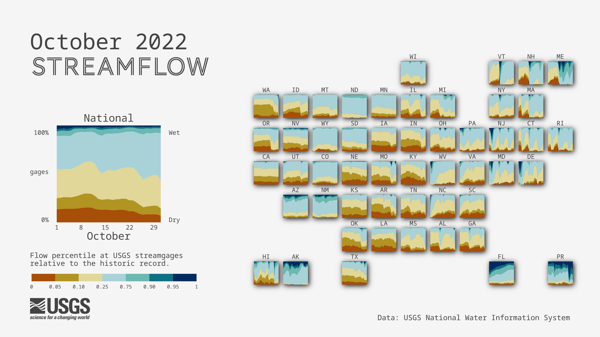

## Recreating the streamflow tile map
  
This repository uses the [`targets` package](https://docs.ropensci.org/targets/) to build the chart. Run `tar_make()` to execute `_targets.R` .  

Install all packages needed to run: 
```
install.packages(c('targets', 'tidyverse', 'lubridate', 'geofacet', 'cowplot','ggfx', 'showtext', 'magick', 'maps', 'svglite', 'xml2', 'dataRetrieval', 'rsvg'))
```

Running `tar_make()` will produce: 




## Data  
This viz piggybacks on the [`gage-conditions-gif`] data processing pipeline (https://github.com/USGS-VIZLAB/gage-conditions-gif) that depends on an internal pipelining package. The data file used corresponds to `scipiper::scmake("2_process/out/dv_stats.rds.ind", "2_process.yml")` generated for a 1-month time period. (Instructions for internal users generating the file used by this viz: either re-run the target for the appropriate dates or filter it to the correct date range. Then save as a CSV. The CSV file needs to be uploaded to the `water-visualizations-prod-website` S3 bucket and live at `visualizations/data/flow_conditions_{YYYYMM}.csv`.)

## Disclaimer

This software is in the public domain because it contains materials that originally came from the U.S. Geological Survey, an agency of the United States Department of Interior. For more information, see the official USGS copyright policy at [http://www.usgs.gov/visual-id/credit_usgs.html#copyright](http://www.usgs.gov/visual-id/credit_usgs.html#copyright)

This information is preliminary or provisional and is subject to revision. It is being provided to meet the need for timely best science. The information has not received final approval by the U.S. Geological Survey (USGS) and is provided on the condition that neither the USGS nor the U.S. Government shall be held liable for any damages resulting from the authorized or unauthorized use of the information. Although this software program has been used by the USGS, no warranty, expressed or implied, is made by the USGS or the U.S. Government as to the accuracy and functioning of the program and related program material nor shall the fact of distribution constitute any such warranty, and no responsibility is assumed by the USGS in connection therewith.

This software is provided "AS IS."


[
  
](http://creativecommons.org/publicdomain/zero/1.0/)
