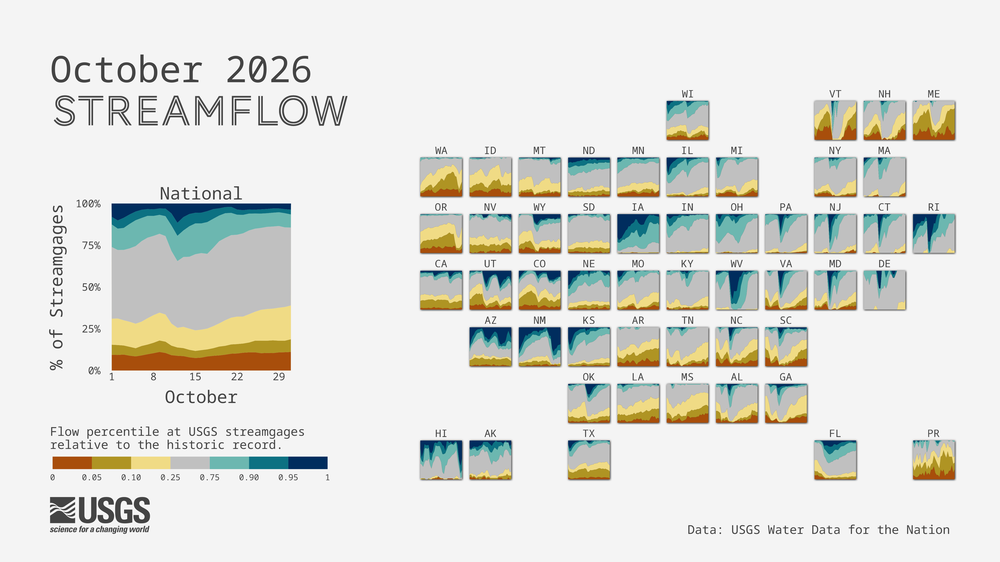
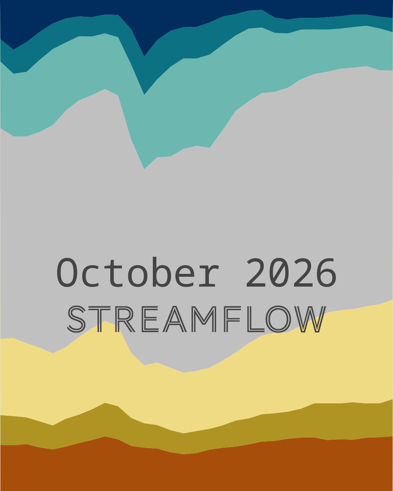
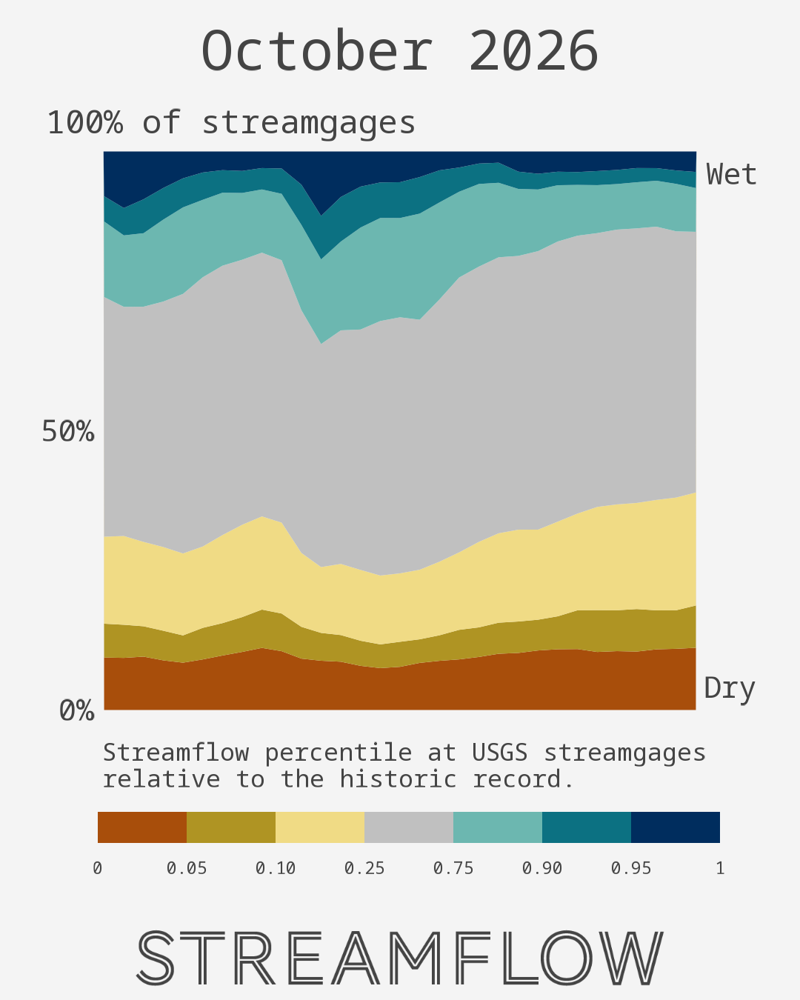
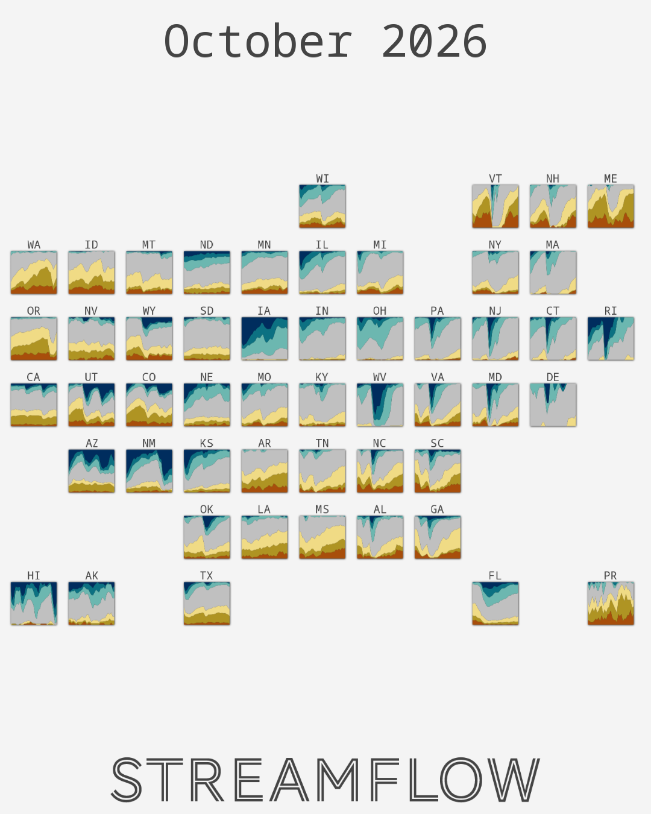

## Recreating the streamflow tile map

This repository uses the [`targets` package](https://docs.ropensci.org/targets/) to build the chart. Run `tar_make()` to execute `_targets.R` .

Install all packages needed to run:

```         
install.packages(c('targets', 'tidyverse', 'lubridate', 'geofacet', 'cowplot', 'ggfx', 'showtext', 'magick', 'maps', 'svglite', 'xml2', 'rsvg', 'ragg', 'arrow', 'dataRetrieval'))
```

Running `tar_make()` will produce:

 

 
 
 

To disable `showtext` font styling after running pipeline, run:

```         
showtext_auto(enable = FALSE)
```

## Data

Streamflow data come from the [current conditions pipeline](https://code.usgs.gov/water/computational-tools/current-conditions-pipeline), which writes a daily parquet file of streamflow percentile categories at USGS streamgages to S3. This pipeline downloads one file per day of the focal month from:

```
https://dfi09q69oy2jm.cloudfront.net/visualizations/current_conditions/streamflow/data/sf_categorizations_{YYYY-MM-DD}.parquet
```

By default `tar_make()` builds the **previous calendar month**. To build a specific month, set `FOCAL_MONTH` first:

```r
Sys.setenv(FOCAL_MONTH = "2026-09-01")
targets::tar_make()
```

The build stops if any day of the month has no file, so the map is never silently partial. To build anyway (e.g. mid-month testing), set `Sys.setenv(ALLOW_INCOMPLETE_MONTH = "true")`.