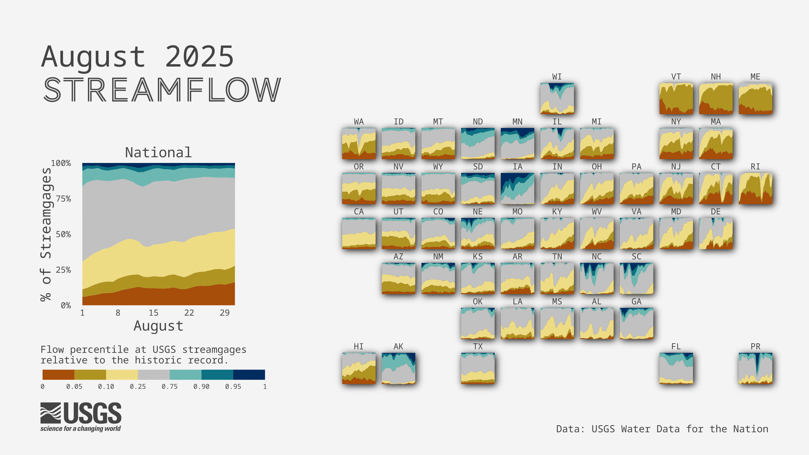
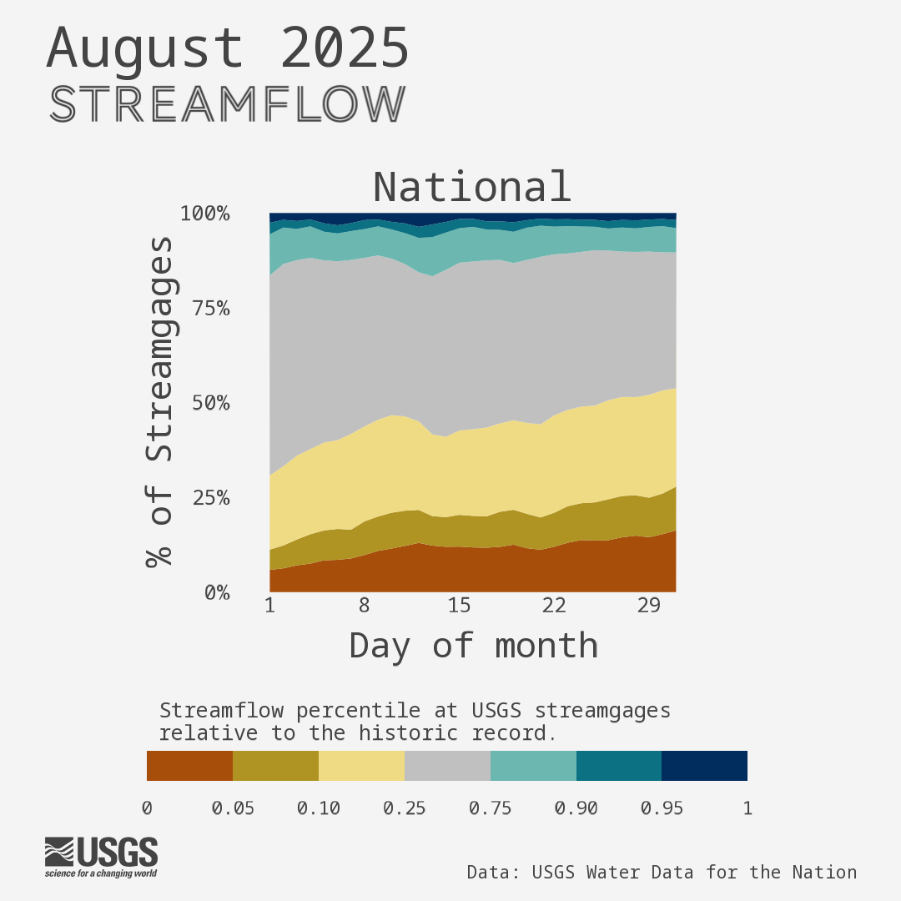
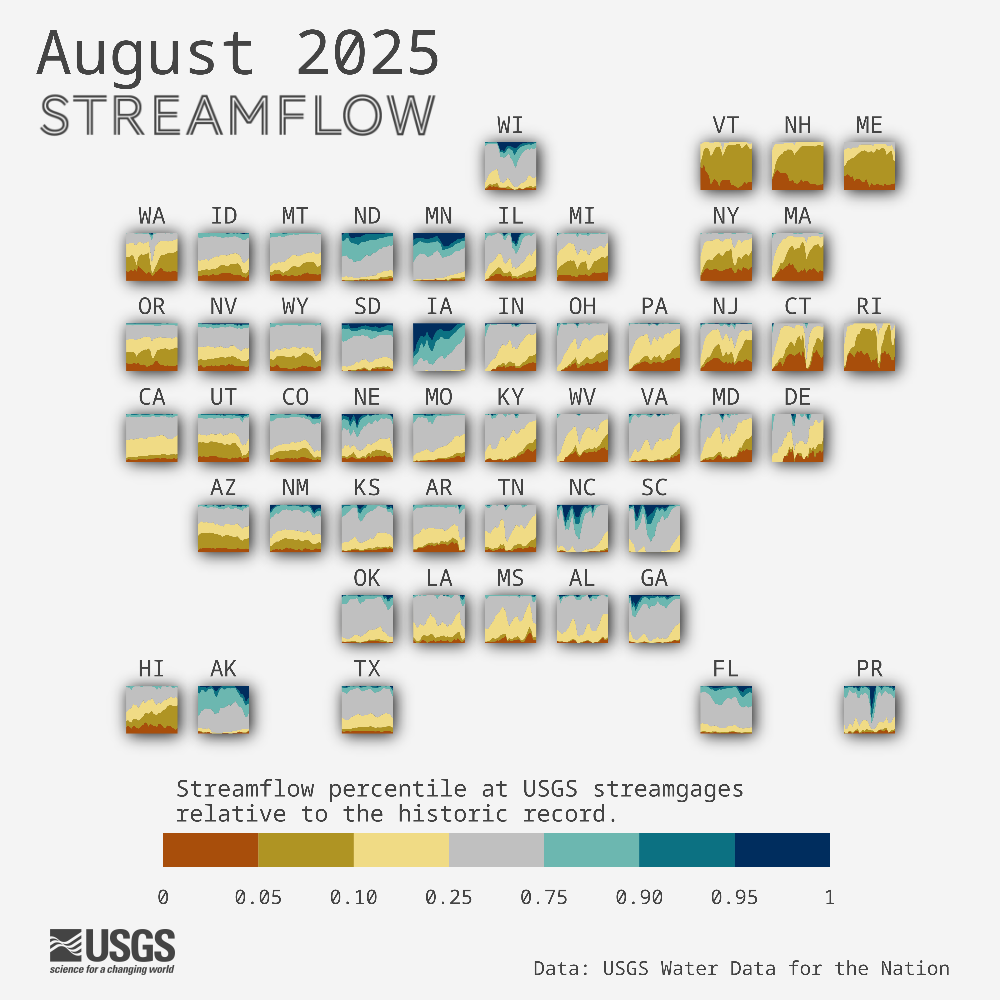

## Recreating the streamflow tile map
  
This repository uses the [`targets` package](https://docs.ropensci.org/targets/) to build the chart. Run `tar_make()` to execute `_targets.R` .  

Install all packages needed to run: 
```
install.packages(c('targets', 'tidyverse', 'lubridate', 'geofacet', 'cowplot','ggfx', 'showtext', 'magick', 'maps', 'svglite', 'xml2'))
```

Running `tar_make()` will produce: 

  


To disable `showtext` font styling after running pipeline, run:
```
showtext_auto(enable = FALSE)
```

## Data  
This viz piggybacks on the [`gage-conditions-gif`] data processing pipeline (https://github.com/USGS-VIZLAB/gage-conditions-gif) that depends on an internal pipelining package. The data file used corresponds to `scipiper::scmake("2_process/out/dv_stats.rds.ind", "2_process.yml")` generated for a 1-month time period. (Instructions for internal users generating the file used by this viz: either re-run the target for the appropriate dates or filter it to the correct date range. Then save as a CSV. The CSV file needs to be uploaded to the `water-visualizations-prod-website` S3 bucket and live at `visualizations/data/flow_conditions_{YYYYMM}.csv`.)


